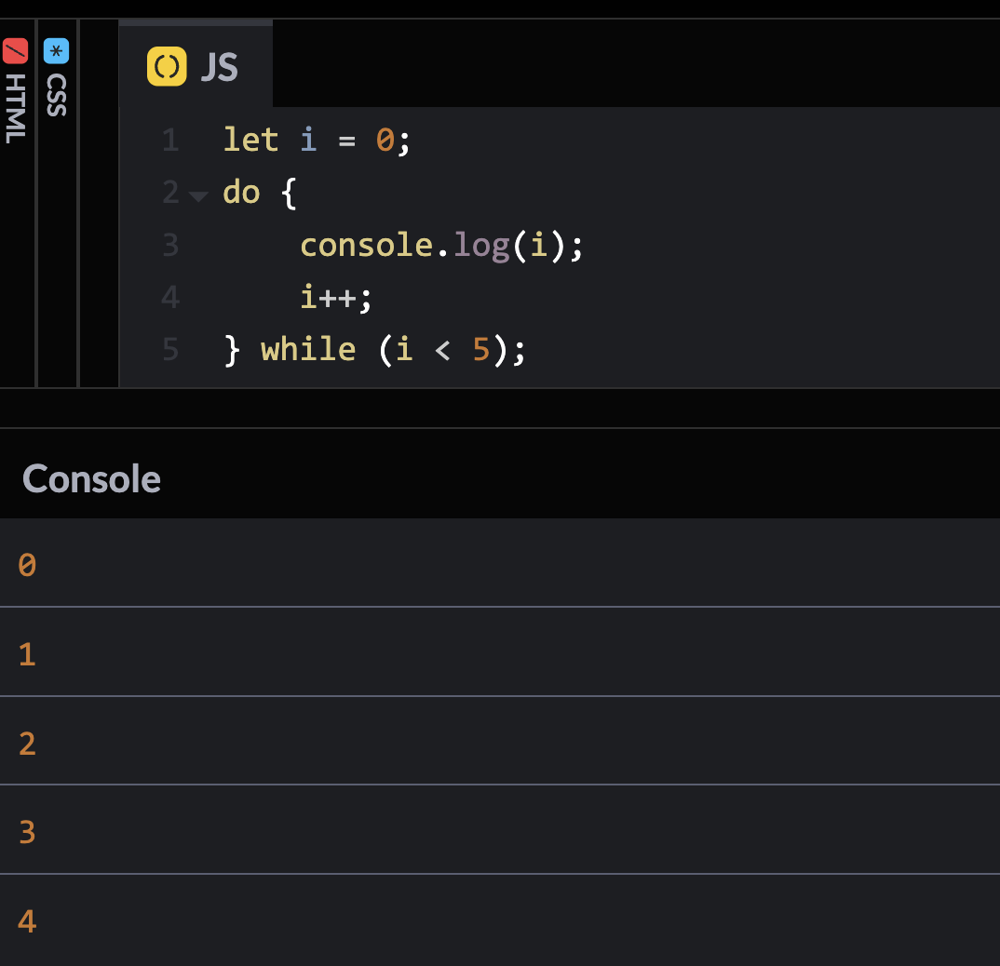

# Checkpoint 8

## 1. ¿Qué tipo de bucles hay en JS?

En JavaScript, hay principalmente tres tipos de bucles que se utilizan para iterar sobre una serie de elementos o realizar tareas repetitivas:
los bucles **for**, **while** y **do-while.** 

Además, es importante tener en cuenta que los hay **bucles infinitos**, como el ejemplo del bucle **while (true)**, también son posibles en JavaScript, pero deben utilizarse con precaución para evitar bloqueos o comportamientos no deseados en el programa."

* **Bucle for**

    El bucle for se utiliza cuando se conoce la cantidad exacta de iteraciones que se deben realizar. Tiene tres partes: la inicialización, la condición y la expresión de iteración. Veamos un ejemplo:

    ```
    for (let i = 0; i < 5; i++) {
        console.log(i);
    }
    ```
    


    En este ejemplo, el **bucle for** imprimirá los números del 0 al 4. La inicialización **let i = 0** establece el contador en 0. La condición **i < 5** especifica que el bucle continuará mientras **i** sea menor que 5. La expresión de iteración **i++** aumenta el valor de **i** en cada iteración.
 ***
 * **Bucle while**
    El bucle while se utiliza cuando no se conoce la cantidad exacta de iteraciones que se deben realizar, pero se conoce la condición de finalización del bucle. Veamos un ejemplo:

    ```
    let i = 0;
    while (i < 5) {
        console.log(i);
        i++;
    }
    ```
    

    En este ejemplo, el **bucle while** también imprimirá los números del 0 al 4. Mientras que **i** sea menor que 5, el bucle seguirá ejecutándose. La variable **i** se incrementa en cada iteración dentro del bucle.

* **Bucle do-while**

    El bucle do-while es similar al bucle while, pero la diferencia es que la condición se verifica al final del bucle, lo que significa que el cuerpo del bucle se ejecutará al menos una vez antes de verificar la condición. Veamos un ejemplo:

    ```
    let i = 0;
    do {
        console.log(i);
        i++;
    } while (i < 5);
    ```
    

    En este ejemplo, el **bucle do-while** también imprimirá los números del 0 al 4. La diferencia clave es que la expresión **do++ se ejecuta al menos una vez antes de verificar la condición en while.

 * **Bucles infinitos**

    Aunque no es recomendable, los **bucles infinitos** son posibles en JavaScript y pueden ser útiles en ciertas situaciones. Sin embargo, debes tener cuidado de evitarlos, ya que pueden hacer que tu programa se bloquee. Veamos un ejemplo:

    ```
    let i = 0;
    while (true) {
        console.log(i);
        i++;
    }
    ```
    

    Este bucle while se ejecutará infinitamente, ya que la condición **true** siempre es verdadera. Es importante evitar los bucles infinitos en tu código, ya que pueden causar que el programa se bloquee o se vuelva irresponsivo. 
    
    Sin embargo, hay algunas situaciones muy específicas en las que un **bucle infinito** puede ser útil o incluso necesario:

    1. **Aplicaciones en tiempo real**: En algunas aplicaciones en tiempo real, como videojuegos o sistemas de control, puede ser necesario ejecutar un bucle infinito para mantener el programa funcionando continuamente, esperando la entrada del usuario o eventos del sistema.
    2. **Servidores y servicios**: En servidores y servicios, como los servidores web o los servidores de aplicaciones, es común tener bucles infinitos que escuchan constantemente las solicitudes de los clientes y manejan las conexiones entrantes.
    3. **Tareas de fondo**: En algunas aplicaciones, puede haber tareas de fondo que necesitan ejecutarse de forma continua, como la actualización de datos en una base de datos o la supervisión de un sistema.
    4. **Bucles de eventos**: En entornos de interfaz de usuario (UI), como aplicaciones web o aplicaciones de escritorio, los bucles de eventos pueden ser esenciales para detectar y responder a eventos del usuario, como clics de ratón o pulsaciones de teclas.
      
## 2. ¿Cuáles son las diferencias entre const, let y var?

Las diferencias entre const, let y var en JavaScript son principalmente en términos de alcance, reasignación y hoisting. A continuación, explicaré cada uno de estos conceptos y proporcionaré ejemplos para cada declaración de variable. El uso adecuado de const, let y var es crucial para escribir código limpio y mantenible en JavaScript. Al elegir entre ellos, es importante considerar el alcance y la mutabilidad de las variables en tu programa.

* **var**

    Las variables declaradas con **var** tienen un alcance de función o global. Esto significa que están disponibles dentro de la función en la que se declaran o en todo el ámbito global, pero no están disponibles fuera de la función en la que se declaran.

    Las variables **var** pueden ser redeclaradas y reasignadas.

    Las variables **var** son elevadas (hoisted) al principio de su ámbito, lo que significa que se pueden usar antes de su declaración. Aunque **var** aún es compatible y funciona en JavaScript, su uso se ha vuelto menos común debido a sus comportamientos impredecibles, como el hoisting y el alcance de función. Por lo tanto, es recomendable evitar **var** en favor de *+const*+ y **let*+, ya que proporcionan un comportamiento más predecible y seguro en la mayoría de los casos.
    Veamos un ejemplo:

    ```
    var x = 10;
    function foo() {
        var y = 20;
        console.log(x); // 10
        console.log(y); // 20
    }
    console.log(x); // 10
    console.log(y); // Error: y is not defined
    ```
    Veamos que sucede en la consola:

    

    Primero, se declara una variable **'x'** con el valor 10 fuera de la función foo. Esta variable  **'x'** tiene un alcance global en todo el script.

    Luego, se define una función llamada foo, dentro de la cual se declara una variable y con el valor 20. Esta variable **'y'** tiene un alcance local dentro de la función foo.

    Se llama a la función foo, y dentro de ella se imprime el valor de las variables **'x'** e **'y'**.

    Como **'x'**  es una variable global, se puede acceder a su valor desde cualquier parte del script, incluida la función foo. Además, como **'y'** es una variable local dentro de la función foo, solo se puede acceder a su valor dentro de la función.

    Finalmente, se intenta imprimir el valor de la variable y fuera de la función foo.

    Como se esperaba, al intentar acceder a la variable y fuera de la función foo, se produce un error porque **'y'** solo está definida dentro del ámbito de la función foo. Esto demuestra cómo funciona el alcance de las variables en JavaScript: las variables globales pueden ser accedidas desde cualquier parte del script, mientras que las variables locales solo pueden ser accedidas desde dentro de la función en la que se declaran.

* **let**

    **let** se introdujo en ES6 (ECMAScript 2015) como una forma mejorada de declarar variables en comparación con **var**.

    Las variables declaradas con **let** tienen un alcance de bloque, lo que significa que están disponibles solo dentro del bloque en el que se declaran.

    Las variables **let** pueden ser reasignadas, pero no redeclaradas en el mismo ámbito.

    Las variables **let** no son elevadas al principio de su ámbito. Se pueden usar solo después de su declaración. Utiliza **let** cuando necesites una variable que puede cambiar su valor a lo largo del programa, pero solo dentro de un bloque de código específico. Esto te permite tener más control sobre la mutabilidad de tus variables y evita posibles errores causados por reasignaciones accidentales. Veamos un ejemplo:

    ```
    let x = 10;
    if (true) {
        let y = 20;
        console.log(x); // 10
        console.log(y); // 20
    }
    console.log(x); // 10
    console.log(y); // Error: y is not defined
    ```
    

    Primero, se declara una variable **'x'** con el valor 10 fuera del bloque if. Esta variable **'x'** tiene un alcance global en todo el script.

    Luego, dentro del bloque if, se declara una variable **'y'** con el valor 20. Esta variable **'y'** tiene un alcance local dentro del bloque if.

    Como **'x'** es una variable global, se puede acceder a su valor desde cualquier parte del script, incluido el bloque if. Además, como **'y'** es una variable local dentro del bloque if, solo se puede acceder a su valor dentro de ese bloque.

    Se imprime el valor de las variables **'x'** e **'y'** dentro del bloque if.

    Después del bloque if, se intenta imprimir el valor de la variable **'y'**.

    Como se esperaba, al intentar acceder a la variable **'y'** fuera del bloque if, se produce un error porque **'y'** solo está definida dentro de ese bloque. Esto demuestra cómo funciona el alcance de las variables declaradas con **let**: 
    Tienen un alcance de bloque, lo que significa que solo son accesibles dentro del bloque en el que se declaran y no fuera de él.

* **const**

    **const** también se introdujo en ES6 y se utiliza para declarar constantes, es decir, variables cuyo valor no puede ser reasignado.

    Las variables declaradas con **const** tienen un alcance de bloque al igual que let.

    Una vez que se asigna un valor a una variable **const**, no se puede reasignar.

    Al igual que con **let**, las variables **const** no son elevadas al principio de su ámbito. Debes utilizar **const** cuando desees declarar una variable cuyo valor no cambiará a lo largo del programa. Esto ayuda a prevenir errores y hace que tu código sea más legible al indicar claramente que esa variable no cambiará. Sin embargo, ten en cuenta que **const** solo garantiza que la referencia a la variable no cambiará, no que el valor en sí no sea mutable en caso de ser un objeto o un array. 
    Veamos un ejemplo:

    ```
    const x = 5;
    const y = 10;

    console.log(`El valor de x es: ${x}`); // El valor de x es: 5
    console.log(`El valor de y es: ${y}`); // El valor de y es: 10
    ```
    

    Primero, se declaran dos constantes, **'x'** e **'y'**, con los valores 5 y 10, respectivamente.

    Las variables **'x'** e **'y'** se inicializan con los valores 5 y 10, respectivamente, utilizando la palabra clave **const**. Al utilizar **const**, estamos declarando que estos valores no cambiarán posteriormente en el código.

    Se imprimen los valores de **'x'** e **'y'** en la consola.

    Este ejemplo simplemente declara dos constantes **'x'** e **'y'** con valores fijos y luego imprime estos valores en la consola. 
    
    La principal característica a destacar aquí es que estas variables se han declarado como constantes (const), lo que significa que sus valores no cambiarán durante la ejecución del programa.

En resumen, **var** tiene un alcance de función o global, permite redeclaraciones y reasignaciones, y se eleva al principio de su ámbito. 
**let** y **const** tienen un alcance de bloque, no permiten redeclaraciones en el mismo ámbito, y **const** además no permite reasignaciones. 

Es recomendable utilizar **const** siempre que sea posible para declarar variables que no cambien de valor, y utilizar **let** para variables que necesiten ser reasignadas.

El uso de **var** se ha vuelto menos común en favor de **let** y **const** debido a sus comportamientos más predecibles y seguros.


## 3. ¿Qué es una función de flecha?

Una función de flecha, también conocida como función flecha o arrow function en inglés, es una característica introducida en ECMAScript 6 (también conocido como ES6 o ECMAScript 2015) que proporciona una sintaxis más concisa y una manera más clara de escribir funciones en JavaScript. Las funciones de flecha tienen algunas diferencias clave en comparación con las funciones tradicionales, y se utilizan comúnmente en el desarrollo moderno de JavaScript debido a su claridad y conveniencia.

A continuación, detallo algunas características y ejemplos de funciones de flecha:

* **Sintaxis concisa:**

    Las funciones de flecha proporcionan una sintaxis más concisa en comparación con las funciones tradicionales de JavaScript, especialmente para funciones que tienen una sola expresión. Veamos un ejemplo:

    ```
    // Función tradicional 
    
    function saludo() {
    console.log('¡Hola desde una función tradicional!');
    }

    saludo(); // Output: ¡Hola desde una función tradicional!

    // Función de flecha equivalente 
    const saludoArrow = () => {
    console.log('¡Hola desde una función de flecha!');
    }

    saludoArrow(); // Output: ¡Hola desde una función de flecha!
    ``` 

    

    En este ejemplo, tanto la función tradicional **saludo** como la función de flecha **saludoArrow** realizan la misma acción:

    Imprimen un mensaje en la consola. La diferencia radica en la sintaxis utilizada para definir las funciones, donde la función de flecha proporciona una sintaxis más concisa y legible.


* **this léxico:**

    Una de las diferencias clave entre las funciones de flecha y las funciones tradicionales es cómo manejan el valor de **this**. Las funciones de flecha no tienen su propio valor **this**, sino que heredan el valor this del ámbito en el que están definidas. Veamos un ejemplo:

    ```
    // Objeto gato

    const gato = {
        sonido: 'Meow',
        dice: function() {
            console.log(`Soy un gato y digo ${this.sonido}`);
        }
    };

    // Objeto perro
    const perro = {
        sonido: 'Woof',
        dice: () => {
            console.log(`Soy un perro y digo ${this.sonido}`);
        }
    };

    gato.dice(); // Output: Soy un gato y digo Meow
    perro.dice(); // Output: Soy un perro y digo undefined
    ```
    

    Primero, creamos el objeto **gato** que tiene una propiedad sonido con el valor **'Meow'**.

    También tiene un método **dice**, definido como una función tradicional, que imprime un mensaje en la consola utilizando *+this.sonido** para acceder al valor de la propiedad **sonido** del objeto **gato**.

    Luego, creamos el objeto **perro** que tiene una propiedad **sonido** con el valor **'Woof'**.

    Sin embargo, tiene un método **dice** definido con una función de flecha (() => { ... }). 
    
    Esto es lo que marca la diferencia con el objeto **gato**.
    La función de flecha **dice** utiliza **this.sonido** para acceder al valor de la propiedad sonido del objeto perro.

    Cuando se llama al método **dice** en cada objeto:

    **gato.dice()** imprimirá "Soy un gato y digo Meow". 
    Esto funciona correctamente porque **this.sonido** dentro del método **dice** hace referencia al objeto **gato**, y accede correctamente a su propiedad **sonido**.

    **perro.dice()** imprimirá "Soy un perro y digo undefined". 
    Esto ocurre porque las funciones de flecha no tienen su propio valor **this**, sino que heredan el valor **this** del contexto en el que fueron definidas. 
    
    En este caso, al ser una función de flecha definida en el ámbito global (el contexto de ejecución en el que se definió el objeto **perro**), **this** hace referencia al objeto global, donde **sonido** no está definido, por lo que imprime **undefined**.

* **Uso en funciones de flecha con un solo argumento:**

    ```
    // Función tradicional con un solo argumento

    const square = function(x) {
        return x * x;
    };

    / Función de flecha equivalente con un solo argumento

    const squareArrow = x => x * x;

    // Valores
    const number1 = 5;
    const number2 = 8;

    // Resultados utilizando la función tradicional

    console.log(`Resultado con la función tradicional para ${number1}:`, square(number1)); // Output: 25

    console.log(`Resultado con la función tradicional para ${number2}:`, square(number2)); // Output: 64

    // Resultados utilizando la función de flecha

    console.log(`Resultado con la función de flecha para ${number1}:`, squareArrow(number1)); // Output: 25

    console.log(`Resultado con la función de flecha para ${number2}:`, squareArrow(number2)); // Output: 64
    ```

    

    Definición de funciones:

    Se definen dos funciones para calcular el cuadrado de un número: una función tradicional llamada **square** y una función de flecha llamada **squareArrow**.
    La función tradicional **square** utiliza la sintaxis **function(x) { return x * x; }** para definirse.

    La función de flecha **squareArrow** utiliza la sintaxis **x => x * x;** para definirse, lo que hace que sea más concisa y legible.

    Valores de prueba:

    Se definen dos variables **number1** y **number2** con valores **5** y **8** respectivamente. Estos valores se utilizarán como argumentos para las funciones.

    Utilizando las funciones:

    Se llama a cada función con los valores **number1** y **number2** como argumentos.

    Se utiliza **console.log** para imprimir los resultados en la consola, junto con un mensaje descriptivo que indica para qué número se calculó el cuadrado y qué función se utilizó.

    Resultados en la consola:

    Cada **console.log** imprime el resultado del cálculo del cuadrado para los números **5** y **8** utilizando ambas funciones **(square** y **squareArrow**).

En resumen, este ejercicio demuestra cómo definir y utilizar funciones tradicionales y de flecha para realizar la misma operación matemática, en este caso, calcular el cuadrado de un número. Luego, muestra cómo imprimir los resultados en la consola para ver el efecto de ambas funciones en los mismos conjuntos de datos de entrada.

* **Uso en funciones de flecha sin argumentos:**

    ```
    // Función tradicional sin argumentos

    const saludo = function() {
        console.log('Hola');
    };

    // Función de flecha equivalente sin argumentos

    const saludoArrow = () => {
        console.log('Hola');
    };

    saludo(); // Imprime 'Hola' en la consola
    saludoArrow(); // Imprime 'Hola' en la consola
    ```
    

    En este ejercicio, se definen dos funciones: **saludo** y **saludoArrow**. Ambas funciones no tienen argumentos y simplemente imprimen **"Hola"** en la consola.

    La Función tradicional **saludo**:

    Se define utilizando la sintaxis de una función tradicional. Toma ningún argumento y simplemente imprime "Hola" en la consola.

    La Función de flecha **saludoArrow**:

    Se define utilizando la sintaxis de una función de flecha. 
    
    Al igual que la función tradicional **saludo**, no toma ningún argumento y también imprime "Hola" en la consola.

    Por último se llaman a ambas funciones utilizando saludo() y saludoArrow(), lo que resulta en la impresión de "Hola" en la consola en ambos casos.


* **No pueden ser utilizadas como constructores:**    

    No pueden ser invocadas con el operador new para crear un nuevo objeto. Si intentas hacerlo, generará un error en tiempo de ejecución. Veamos un ejemplo:

    ```
    // Definimos una función de flecha
    const MiClase = () => {
        this.propiedad = 'Valor'; // Esto generará un error
    };

    // Intentamos crear una instancia utilizando la función de flecha como constructor

    const instancia = new MiClase(); // Esto generará un error en tiempo de ejecución
    ```
    

    En este ejemplo, estamos intentando definir una función de flecha llamada **MiClase**, que intenta asignar un valor a la propiedad **propiedad** del objeto **this**. Sin embargo, al intentar utilizar **this** dentro de una función de flecha, no se refiere al objeto creado por el constructor como lo haría en una función tradicional. En su lugar, **this** en una función de flecha se hereda del contexto léxico externo, que en este caso es el ámbito global o el ámbito de la función que contiene la definición de la función de flecha.

    Cuando intentamos crear una instancia de **MiClase** utilizando el operador **new**, se generará un error en tiempo de ejecución. Esto se debe a que las funciones de flecha no pueden ser utilizadas como constructores para crear nuevos objetos.


En resumen, las funciones de flecha son una característica poderosa y útil en JavaScript que proporciona una sintaxis más concisa, una forma más clara de manejar el valor this, y una manera más elegante de escribir funciones en el desarrollo moderno de JavaScript.


## 4. ¿Qué es la deconstrucción variable?

La deconstrucción de variables en JavaScript es una característica que permite extraer valores de arrays o propiedades de objetos y asignarlos a variables individuales de una manera más concisa y legible. 

Esto es útil cuando se trabaja con estructuras de datos complejas como arrays y objetos, ya que permite acceder a sus elementos de forma más directa.

La deconstrucción de variables se realiza utilizando la sintaxis de corchetes [] para arrays y la sintaxis de llaves {} para objetos. Se puede realizar tanto en la declaración de variables como en la asignación de valores a las mismas.

Veamos unos ejemplos:

* **Deconstrucción de Arrays**

    En la deconstrucción de un array, se utilizan corchetes [ ] para indicar que se está extrayendo valores de un array y se asignan a variables individuales en el mismo orden en que aparecen en el array.

    ```
    const numbers = [1, 2, 3];
    const [a, b, c] = numbers;

    console.log(a); // Output: 1
    console.log(b); // Output: 2
    console.log(c); // Output: 3
    ```
    

    En este ejemplo, los valores del array **numbers** se asignan a las variables a, b y c, respectivamente.

* **Deconstrucción de Objetos**

    En la deconstrucción de un objeto, se utilizan llaves { } para indicar que se está extrayendo propiedades de un objeto y se asignan a variables con el mismo nombre que las propiedades.

    ```
    const person = { name: 'John', age: 30 };
    const { name, age } = person;

    console.log(name); // Output: John
    console.log(age); // Output: 30
    ```
    

    En este ejemplo, las propiedades **name** y **age** del objeto person se asignan a las variables del mismo nombre.

* **Asignación de Nombres Personalizados**

    También es posible asignar nombres personalizados a las variables durante la deconstrucción, utilizando la sintaxis nombreOriginal: nombrePersonalizado.

    ```
    const person = { name: 'John', age: 30 };
    const { name: fullName, age: years } = person;

    onsole.log(fullName); // Output: John
    console.log(years); // Output: 30
    ```

    

    En este ejemplo, las propiedades **name** y **age** se asignan a las variables **fullName** y **years**, respectivamente.

* **Deconstrucción en Funciones**

    La deconstrucción de variables también se puede utilizar en funciones para extraer valores de objetos pasados como argumentos.

    ```
    function printInfo({ name, age }) {
        console.log(`Name: ${name}, Age: ${age}`);
    }

    const person = { name: 'Alice', age: 25 };
    printInfo(person); // Output: Name: Alice, Age: 25
    ```
    

    En este ejemplo, la función **printInfo** utiliza la deconstrucción de variables para extraer las propiedades **name** y **age** del objeto **person** pasado como argumento.


La deconstrucción de variables es una característica muy útil en JavaScript que facilita el trabajo con arrays y objetos al proporcionar una forma más elegante y expresiva de acceder a sus elementos y propiedades.

## 5. ¿Qué hace el operador de extensión en JS?

El operador de propagación o spread en JavaScript es una característica que se utiliza para descomponer arrays u objetos en elementos individuales. 

Permite expandir una expresión en lugares donde se esperan múltiples argumentos o elementos. Este operador se representa mediante tres puntos suspensivos '...'

Veamos unos ejemplos:

* **Para Arrays:**

    En el contexto de los arrays, el operador de spread se utiliza para copiar los elementos de un array en otro array nuevo, o para pasar los elementos de un array como argumentos a una función.

    * **Copiar un Array**

        ```
        const array1 = [1, 2, 3];
        const array2 = [...array1];

        console.log(array2); // Output: [1, 2, 3]
        ```
        

        En este ejemplo, **array1** es un array existente **[1, 2, 3]**.

        Usando el operador de spread **...**, se crea un nuevo array **array2** que contiene los mismos elementos que **array1**.

        Al imprimir array2, se muestra **[1, 2, 3]**, lo que indica que se ha copiado correctamente array1. 

    * **Unir Arrays**

        ```
        const array1 = [1, 2, 3];
        const array2 = [4, 5, 6];
        const newArray = [...array1, ...array2];

        console.log(newArray); // Output: [1, 2, 3, 4, 5, 6]
        ```
        

        En este ejemplo, se tienen dos arrays **array1** y **array2**.

        Usando el operador de spread **...**, se unen los elementos de ambos arrays en un nuevo array **newArray**.

        Al imprimir **newArray**, se muestra **[1, 2, 3, 4, 5, 6]**, lo que indica que los arrays se han unido correctamente.

    * **Pasar Argumentos a una Función**

        ```
        function sum(a, b, c) {
            return a + b + c;
        }

        const numbers = [1, 2, 3];
        const result = sum(...numbers);

        console.log(result); // Output: 6
        ```
        

       En este ejemplo, se tiene una función **sum** que espera tres argumentos.

       Usando el operador de spread **...**, los elementos del array **numbers** se pasan como argumentos a la función **sum**.

       Al imprimir **result**, se muestra **6**, que es la suma de los elementos del array.

* **Para Objetos:**

    * **Copiar un Objeto**

        ```
         const obj1 = { x: 1, y: 2 };
         const obj2 = { ...obj1 };

         console.log(obj2); // Output: { x: 1, y: 2 }
        ```
        

        En este ejemplo, **obj1** es un objeto existente **{ x: 1, y: 2 }**.

        Usando el operador de spread **...**, se crea un nuevo objeto **obj2** que contiene las mismas propiedades que **obj1**.

        Al imprimir **obj2**, se muestra **{ x: 1, y: 2}**, lo que indica que se ha copiado correctamente **obj1**.

    * **Fusionar Objetos**

        ```
        const obj1 = { x: 1, y: 2 };
        const obj2 = { z: 3 };
        const newObj = { ...obj1, ...obj2 };

        console.log(newObj); // Output: { x: 1, y: 2, z: 3 }
        ```
        

        En este ejemplo, se tienen dos objetos **obj1** y **obj2**.

        Usando el operador de spread *+...**, 
        se fusionan las propiedades de ambos objetos en un nuevo objeto **newObj**.

        Al imprimir **newObj**, se muestra **{ x: 1, y: 2, z: 3 }**, lo que indica que los objetos se han fusionado correctamente.
        
    * **Agregar Nuevas Propiedades**

        ```
        const obj1 = { x: 1, y: 2 };
        const newObj = { ...obj1, z: 3 };

        console.log(newObj); // Output: { x: 1, y: 2, z: 3 }
        ```

        

        En este ejemplo, **obj1** es un objeto existente **{ x: 1, y: 2 }**.

        Usando el operador de spread **...**, se crea un nuevo objeto **newObj** que contiene las mismas propiedades que **obj1** y además una nueva propiedad **z: 3**.

        Al imprimir **newObj**, se muestra **{ x: 1, y: 2, z: 3 }**, lo que indica que la nueva propiedad se ha agregado correctamente.

En resumen, el operador de spread **...** es una herramienta muy útil en JavaScript para copiar, unir y trabajar con arrays y objetos de una manera más conveniente y eficiente.

## 6. ¿Qué es la programación orientada a objetos?

La programación orientada a objetos (OOP) en JavaScript es un paradigma de programación que se basa en el concepto de "objetos". 

Los objetos son entidades que combinan datos (propiedades) y comportamientos (métodos) relacionados. 

La OOP se centra en modelar el mundo real en forma de objetos y permite organizar el código de manera más estructurada, modular y reutilizable.

* **Principios de la POO en JavaScript**

    * **Encapsulamiento:** 
    
        Consiste en ocultar los detalles de implementación de un objeto y exponer solo la interfaz necesaria para interactuar con él. En JavaScript, se puede lograr el encapsulamiento mediante el uso de propiedades y métodos privados y públicos.

     * **Herencia:** 
     
        Permite que un objeto herede propiedades y métodos de otro objeto. Esto promueve la reutilización del código y la creación de jerarquías de objetos. En JavaScript, la herencia se implementa mediante prototipos y el mecanismo de herencia prototípica.

     * **Polimorfismo:** 
        Se refiere a la capacidad de los objetos para responder de manera diferente a la misma invocación de método. Esto permite que diferentes objetos compartan el mismo nombre de método pero lo implementen de manera diferente. En JavaScript, el polimorfismo se puede lograr mediante la implementación de métodos con el mismo nombre en diferentes objetos.      


* **Ejemplo de Programación Orientada a Objetos:**

    Supongamos que queremos modelar un sistema de gestión de empleados. Podríamos crear una clase Empleado que represente a cada empleado:


    ```
    class Empleado {
        constructor(nombre, salario) {
            this.nombre = nombre;
            this.salario = salario;
        }

        trabajar() {
            console.log(`${this.nombre} está trabajando.`);
        }

        obtenerSalario() {
            console.log(`${this.nombre} gana ${this.salario} dólares.`);
        }
    }

    const empleado1 = new Empleado('Juan', 3000);
    const empleado2 = new Empleado('María', 3500);

    empleado1.trabajar(); // Output: Juan está trabajando.

    empleado2.obtenerSalario(); // Output: María gana 3500 dólares.
    ```

    

    En este ejemplo, la clase **Empleado** tiene dos propiedades **(nombre y salario)** y dos métodos **(trabajar()** y **obtenerSalario())**. Ahora podemos crear objetos individuales que representen empleados específicos:

    Aquí, **empleado1** y **empleado2** son objetos de la clase **Empleado**, cada uno con su propio nombre y salario. Podemos llamar a los métodos de estos objetos para realizar acciones específicas, como trabajar o obtener el salario.

Este es solo un ejemplo básico de cómo se puede aplicar la programación orientada a objetos en JavaScript. La OOP proporciona un enfoque organizado y modular para el desarrollo de software, lo que facilita la creación, mantenimiento y escalabilidad de aplicaciones.


## 7. ¿Qué es una promesa en JS?
 
 Una promesa en JavaScript es un objeto que representa la finalización (o falla) eventual de una operación asíncrona y su resultado asociado. 
 
 Las promesas se utilizan para manejar tareas asíncronas de una manera más limpia y fácil de leer, evitando el uso excesivo de devoluciones de llamada anidadas (callback hell) y mejorando la legibilidad y mantenibilidad del código.

* **Características de las Promesas**

    * **Estado:**
        
        Una promesa puede estar en uno de tres estados: 
        
        pendiente (pending),

        resuelta (fulfilled) 

        rechazada (rejected).

    * **Callbacks:**

        Las promesas pueden encadenarse mediante métodos **.then()** y **.catch()**, que se ejecutan cuando la promesa se resuelve o se rechaza, respectivamente.

* **Características Adicionales de las Promesas**

    * **Encadenamiento:**
    
        Las promesas permiten encadenar múltiples operaciones asíncronas de manera fácil y legible.
         
        Esto se logra devolviendo una nueva promesa en cada llamada a los métodos **.then()** y **.catch()**, lo que permite construir una cadena de operaciones asíncronas de manera secuencial.

    * **Manejo de Múltiples Promesas:**

        La clase Promise proporciona métodos útiles como **Promise.all()** y **Promise.race()** para manejar múltiples promesas de manera eficiente. 
        
        **Promise.all()** espera a que todas las promesas se resuelvan o alguna de ellas se rechace, mientras que **Promise.race()** resuelve o rechaza la primera promesa que se resuelva o se rechace.

    * **Compatibilidad con Async/Await:**

        Las promesas son la base del uso de async/await en JavaScript moderno. La sintaxis async/await proporciona una forma más concisa y legible de trabajar con código asíncrono, permitiendo que el código se vea y se comporte de manera más similar al código síncrono tradicional.

    * **Transparencia:**

        Las promesas son transparentes en su comportamiento y manejo de errores. A través de los métodos **.then()** y **.catch()**, los desarrolladores pueden comprender fácilmente cómo se manejan las operaciones asíncronas y qué acciones se toman en caso de éxito o error.

    * **Versatilidad:**

        Las promesas son versátiles y se pueden utilizar para manejar una amplia variedad de tareas asíncronas, como solicitudes HTTP, operaciones de E/S de archivos, temporizadores, eventos de usuario, entre otros.              

Estos puntos adicionales resaltan la utilidad y flexibilidad de las promesas en JavaScript, así como sus diversas capacidades para manejar operaciones asíncronas de manera efectiva y elegante.


 * **Ejemplo de Promesa:**

     Supongamos que queremos cargar datos de un servidor de manera asíncrona. Podemos usar una promesa para manejar esta operación:

     ```
     function cargarDatos() {
            return new Promise((resolve, reject) => {
                // Simulando una operación asíncrona (por ejemplo, una solicitud HTTP)

            setTimeout(() => {
                const exito = true; // Simulando el éxito de la operación
                if (exito) {
                    const datos = { usuario: 'ejemplo', edad: 25 };
                    resolve(datos); // Resolvemos la promesa con los datos
                } else {
                reject('Error al cargar los datos'); // Rechazamos la promesa con un mensaje de error
                }
            }, 2000); // Simulamos un tiempo de espera de 2 segundos
         });
    }

    cargarDatos()
        .then(datos => {
            console.log('Datos cargados exitosamente:', datos);
        })
        .catch(error => {
            console.error('Error al cargar los datos:', error);
        });
    ```

    

    En este ejemplo, la función **cargarDatos()** devuelve una nueva promesa que representa la carga de datos desde el servidor. Dentro del constructor de la promesa, se realiza una operación asíncrona (simulada aquí con **setTimeout**). 
    
    Si la operación tiene éxito, se resuelve la promesa con los datos obtenidos; de lo contrario, se rechaza la promesa con un mensaje de error.

    Ahora podemos consumir esta promesa usando el método **.then()** para manejar el caso de éxito y **.catch()** para manejar el caso de error:

    El método **.then()** se ejecuta cuando la promesa se resuelve exitosamente, y el método **.catch()** se ejecuta si la promesa es rechazada. Esto permite un manejo elegante y eficiente de operaciones asíncronas en JavaScript, mejorando la legibilidad y mantenibilidad del código.

## 7. ¿Qué hacen async y await por nosotros?

**async** y **await** son características introducidas en ECMAScript 2017 (ES8) que simplifican y mejoran el manejo de operaciones asíncronas en JavaScript. 

Permiten escribir código asíncrono de manera más clara y legible, eliminando la necesidad de usar devoluciones de llamada (callbacks) o encadenamiento excesivo de promesas.

* **Funcionamiento de async y await:**

    * **async:** 
    
        La palabra clave **async** se coloca antes de la declaración de una función para indicar que dicha función retornará una promesa. Una función marcada como async siempre retornará una promesa, incluso si la función en sí no devuelve explícitamente una promesa.

    * **await:** 
    
        La palabra clave **await** se utiliza dentro de una función async para esperar que una promesa se resuelva antes de continuar con la ejecución del código. 
        
        **await** detiene la ejecución de la función **async** hasta que la promesa se resuelva o se rechace. 
        
        Permite que el código asíncrono se vea y se comporte como código síncrono, lo que facilita la escritura y comprensión del código.


* **Ejemplo de Uso:**

    Supongamos que queremos cargar datos de un servidor utilizando una función **fetch()** en JavaScript. 

    Aquí hay un ejemplo de cómo se haría utilizando async y await:

    ```
    async function cargarDatos() {
      try {
        const respuesta = await fetch('https://api.example.com/datos');
        if (!respuesta.ok) {
          throw new Error('Error al cargar los datos');
        }
        const datos = await respuesta.json();
        return datos;
      } catch (error) {
        console.error('Error:', error.message);
        return null;
      }
    }

    // Llamada a la función cargarDatos
    async function main() {
      console.log('Iniciando la carga de datos...');
      const datos = await cargarDatos();
      if (datos) {
        console.log('Datos cargados:', datos);
      } else {
        console.log('No se pudieron cargar los datos');
      }
    }

    main();
    ```
    

    En este ejemplo:

    La función **cargarDatos()** es declarada como **async**, lo que indica que retornará una promesa.

    Dentro de **cargarDatos()**, utilizamos **await** para esperar a que **fetch()** devuelva una respuesta. Esto detiene la ejecución de la función hasta que la respuesta esté disponible.

    Utilizamos un bloque **try...catch** para manejar cualquier error que pueda ocurrir durante la carga de datos. Si se produce un error, lo capturamos y lo manejamos apropiadamente.

    La función **main()** es declarada como **async**, lo que nos permite utilizar **await** para esperar a que **cargarDatos()** termine de ejecutarse antes de continuar con el resto del código.

    Finalmente, llamamos a **main()** para iniciar el proceso de carga de datos.


**Ventajas de async y await:**

* **Código más legible:**

    El uso de **async** y **await** hace que el código asíncrono sea más fácil de entender y mantener, ya que se asemeja a la estructura y estilo del código síncrono.

* **Manejo simplificado de errores:**

    La combinación de **try...catch** con **await** simplifica el manejo de errores en código asíncrono, permitiendo un manejo más claro y efectivo de los errores.

* **Encadenamiento simplificado:**

    **await** permite encadenar operaciones asíncronas de manera natural y secuencial, sin necesidad de anidación excesiva o encadenamiento de promesas.


En resumen, **async** y **await** son herramientas poderosas que hacen que el manejo de operaciones asíncronas en JavaScript sea más intuitivo, legible y fácil de mantener. Permiten escribir código asíncrono de manera similar al código síncrono, lo que mejora significativamente la experiencia de desarrollo en el lenguaje.


    


    
  
